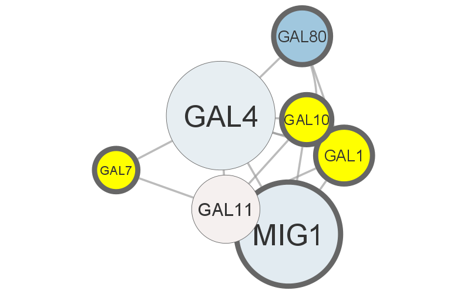
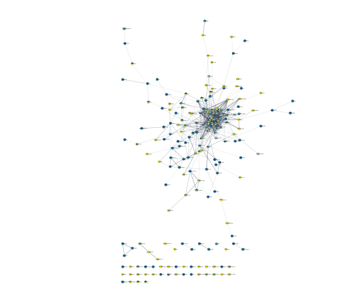
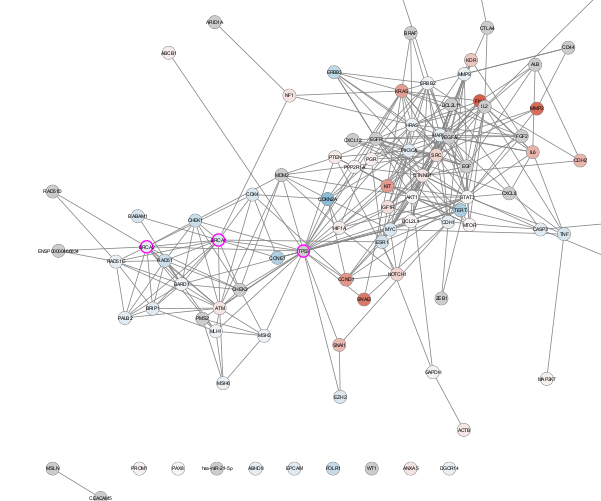

```{r setup, include=FALSE}
knitr::opts_chunk$set(echo = TRUE)
```


```{r, eval=FALSE}

if (!requireNamespace("BiocManager", quietly = TRUE))
  install.packages("BiocManager")

BiocManager::install("RCy3")

```

```{r}

library("RCy3")
cytoscapePing()

```

```{r}

nodes <- data.frame(id=c("node 0","node 1","node 2","node 3"),
           group=c("A","A","B","B"),
           score=as.integer(c(20,10,15,5)),
           stringsAsFactors=FALSE)
edges <- data.frame(source=c("node 0","node 0","node 0","node 2"),
           target=c("node 1","node 2","node 3","node 3"),
           interaction=c("inhibits","interacts","activates","interacts"),  # optional
           weight=c(5.1,3.0,5.2,9.9), # numeric
           stringsAsFactors=FALSE)

createNetworkFromDataFrames(nodes,edges, title="my first network", collection="DataFrame Example")


```


# Basic Data Visualization Graph




# Differentially Expressed Genes Grap (example 1)



# Differentially Expressed Genes Grap (example 2)




