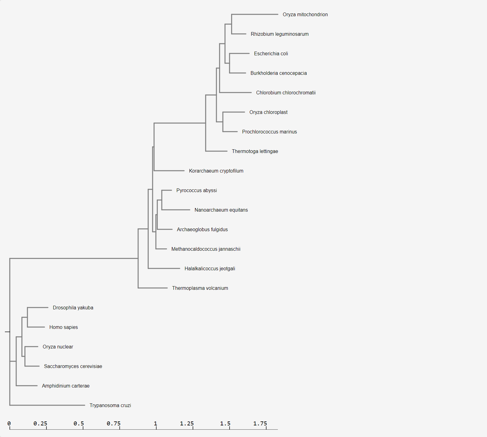

```{r setup, include=FALSE}
knitr::opts_chunk$set(echo = TRUE)
```


# Exercises

# 1

This is the phylogenetic tree created from the set of rRNA sequences provided from Moodle, using NGPhylogeny.fr. It shows the evolutionary relatedness of the different species, based on their genetic sequences.




# 2

Instructions: Align and do phylogenetic analysis off the sequences in CIPRES using MAFFT and FastTreeMP. Here is my step by step tutorial on using CIPRES. You will need to click on Parameter Set and Save even if you don’t change the parameters. Download the fastree_result.tre to your computer.


# 3
Go through the tutorial on Visualizing and Annotating Phylogenetic Trees with R+ggtree adding the steps to your .Rmd file.

#ggtree package

```{r}

BiocManager::install("ggtree")

```


```{r}

library(tidyverse)
library(ggtree)
library(treeio)
library(ggimage)

```

#Basic Trees

```{r}

library(tidyverse)
library(ggtree)
tree <- read.tree("data/tree_newick.nwk")
tree

```


```{r}

ggplot(tree) + geom_tree() + theme_tree()
ggtree(tree)

```

```{r}

ggtree(tree) + geom_treescale()
ggtree(tree) + theme_tree2()

```


```{r}

ggtree(tree, branch.length = "none")

```


```{r}

ggtree(tree, branch.length = "none", color = "blue", size = 2, linetype = 3)

```

#Exercise 1

1: slanted phylogenetic tree

```{r}

ggtree(tree, layout = "slanted")

```


2: circular phylogenetic tree

```{r}

ggtree(tree, layout= "circular")

```


3

```{r}

ggtree(tree, color = "red", size = 3)

```


#Other tree geoms

```{r}

p <- ggtree(tree)
p + geom_nodepoint()
p + geom_tippoint()
p + geom_tiplab()

```

#Exercise 2

```{r}

ggtree(tree) +
  geom_nodepoint(alpha = 0.5, color = "orange", size = 3) +
  geom_tippoint(color = "purple", shape = "diamond") +
  geom_tiplab(color = "purple") +
  ggtitle("Phylogenetic tree with new aesthetics")

```


#Internal node number

```{r}

ggtree(tree) + geom_text(aes(label = node), hjust = -.3)

```


```{r}

ggtree(tree) + geom_tiplab()

```


```{r}

MRCA(tree, c("C", "E"))

```

```{r}

MRCA(tree, c("G", "H"))

```

#Labeling clades

```{r}

ggtree(tree) +
  geom_cladelabel(node = 17, label = "Some randome clade", color = "red")

```

```{r}

ggtree(tree) +
  geom_tiplab() +
  geom_cladelabel(node = 17, label = "Some random clade",
                  color = "red2", offset = .8)

```

```{r}

ggtree(tree) + 
  geom_tiplab() +
  geom_cladelabel(node = 17, label = "Some random clade",
                  color = "red2", offset = .8) +
  geom_cladelabel(node = 21, label = "A different clade",
                  color = "blue", offset = .8)

```

```{r}

ggtree(tree) + 
  geom_tiplab() + 
  geom_cladelabel(node=17, label="Some random clade", 
                  color="red2", offset=.8, align=TRUE) + 
  geom_cladelabel(node=21, label="A different clade", 
                  color="blue", offset=.8, align=TRUE) + 
  theme_tree2() + 
  xlim(0, 70) + 
  theme_tree()

```


