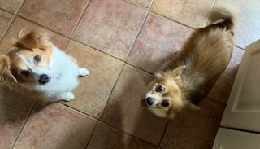

```{r setup, include=FALSE}
knitr::opts_chunk$set(echo = TRUE)
```



# Labs

* Lab 1: [Introduction to R and Reproducible Research](Lab1.html)

* Lab 2: [git, GitHub and Reproducible Research](Lab2.html)

* Lab 3A: [Starting with the Data](Lab3A.html)

* Lab 3B: [Manipulating Data](Lab3B.html)

* Lab 4: [Data Wrangling and Graphing COVID-19 Reporting Data, Part 1](Lab4.html)

* Lab 5: [Data Wrangling and Graphing COVID-19 Reporting Data, Part 2](Lab5.html)


